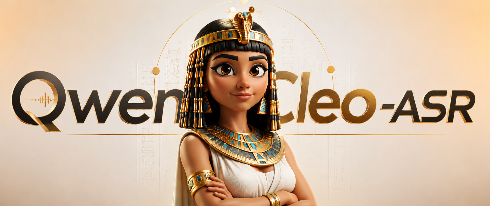
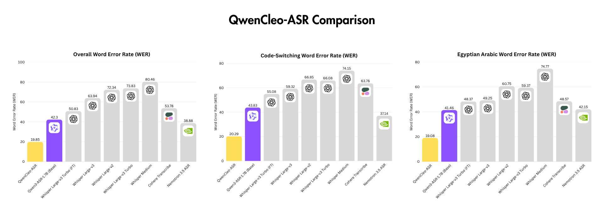

<div align="center">

# 🎙️ QwenCleo-ASR

### The best open-source model for Egyptian Arabic & code-switching speech recognition

*Built on [Qwen3-ASR-1.7B](https://huggingface.co/Qwen/Qwen3-ASR-1.7B), fine-tuned for Egyptian dialect and Arabic ↔ English code-switching.*

[](https://huggingface.co/mohammedaly22/QwenCleo-ASR)
[](https://pypi.org/project/qwencleo-asr/)
[](https://huggingface.co/Qwen/Qwen3-ASR-1.7B)
[](LICENSE)

</div>





---

> **QwenCleo** — the name carries three meanings: **Qwen**, the powerful base model it is built on; **Queen**, signalling a model that reigns over its domain; and **Cleo**, for **Cleopatra**, the queen of Egypt — because this model is tailored for **Egyptian** Arabic. 👑🏺

**QwenCleo-ASR is, to our knowledge, the best open-source ASR model for Egyptian Arabic and Arabic/English code-switching.** It cuts the error rate of the strong Qwen3-ASR base **roughly in half**, and correctly keeps embedded English tech/loan words in Latin script (`engineering`, `download`, `React`, `at least`) instead of mangling them into broken Arabic.

- 🎯 **Egyptian dialect** — tuned on hundreds of hours of Egyptian podcast speech.
- 🔀 **Code-switching** — keeps English terms in `code`-script, Arabic in Arabic.
- 🥇 **State-of-the-art (open)** — beats Qwen3-ASR base, NVIDIA Nemotron, Cohere, and every Whisper variant on our Egyptian + CS test set.
- 📦 **`pip install qwencleo-asr`** — inference & streaming in three lines.
- 🚀 **Serving** — FastAPI server, Gradio demo, and vLLM instructions included.

---

## 📊 Results

WER / CER (%) on an Egyptian-Arabic + code-switching test set (3,699 utterances).
**Lower is better.** All models scored with the same Egyptian-aware normalization.



<div align="center">

| Model | Params | WER all | CER all | WER · AR | CER · AR | WER · CS | CER · CS |
|---|---:|---:|---:|---:|---:|---:|---:|
| **🏆 QwenCleo-ASR** | 1.7B | **19.85** | **10.64** | **19.08** | **10.43** | **20.29** | **10.92** |
| NVIDIA Nemotron-3.5 | 0.6B | 38.88 | 20.58 | 37.14 | 17.40 | 42.15 | 26.30 |
| Qwen3-ASR-1.7B (base) | 1.7B | 41.51 | 20.86 | 40.59 | 18.52 | 43.20 | 25.04 |
| Whisper Large-v3 Turbo (FT) | 0.81B | 50.83 | 22.86 | 48.37 | 18.42 | 55.08 | 37.84 |
| Cohere Transcribe 03-2026 | 2.0B | 53.78 | 39.63 | 48.57 | 34.12 | 63.76 | 49.66 |
| Whisper Large-v3 | 1.54B | 63.94 | 39.76 | 49.25 | 22.76 | 59.32 | 31.52 |
| Whisper Large-v2 | 1.54B | 72.34 | 48.73 | 60.75 | 33.21 | 66.85 | 40.75 |
| Whisper Large-v3 Turbo | 0.81B | 73.83 | 46.86 | 59.37 | 29.42 | 66.08 | 37.84 |
| Whisper Medium | 0.76B | 80.46 | 53.19 | 74.77 | 41.76 | 74.15 | 44.90 |
| Whisper Small | 0.24B | 89.99 | 60.34 | 77.42 | 42.53 | 87.09 | 55.22 |
| Whisper Tiny | 0.04B | 124.68 | 89.42 | 116.02 | 77.74 | 110.67 | 74.57 |

</div>


## 🗣️ Sample outputs

Real transcriptions from the test set. **Ground truth** first; each model's output below it.
Notice how QwenCleo keeps English terms in Latin script and Egyptian dialect intact, while
the other models transliterate English into broken Arabic or drop words entirely.

### 🔀 Code-switching

> **✅ Ground truth**
> طب وانتوا يعني ك`engineering` المفروض ان بيكون مثلا ال`staff engineer` بيقعد مع ال`engineering managers`

| Model | Output |
|---|---|
| 🏆 **QwenCleo** | طب وانتوا يعني ك`engineering` المفروض ان بيكون مثلا ال`staff engineer` بيقعد مع ال`engineering managers` ✅ |
| Qwen3-ASR (base) | وأنتوا يعني كإنجنييرينج المفروض إنه بيكون مثلاً الأستاف إنجنيير بيعد مع ال engineering managers ❌ |
| Cohere Transcribe | وانتم كانجينيري المفروض ان يكون مثلا الاستفاده من الهدف ❌ *(truncated)* |
| Nemotron 3.5 ASR | وانتو يعني كإنجينير المفروض ان بيكون مثلاً الإستف إنجنير بيقعد مع الإنجنير مانيجرز ❌ |

> **✅ Ground truth**
> يعني شوية حاجات كده `across` كل ال`domains` او `at least` يعني مع 4 5 `squads` فالموضوع صعب

| Model | Output |
|---|---|
| 🏆 **QwenCleo** | يعني شوية حاجات كده `across` كل ال`domains` او `at least` يعني مع 4 5 `squads` فالموضوع صعب ✅ |
| Qwen3-ASR (base) | يعني شوية حاجات كده أكرس كل الدومينز وأتلست يعني مع أربعة خمسة سكوات ❌ |
| Cohere Transcribe | يعني شويه حاجات كده اكروس كل الدومينز او اتليست مع اربع خمسه سكوات ❌ |
| Nemotron 3.5 ASR | يعني آه شوائد حاجات كده أكرس كل الدومين أو أتليست يعني مع أربع خمسة سكوات ❌ |

> **✅ Ground truth**
> يقعد معاك حد مثلا من اللي هما ال `C level` او مثلا `engineer manager` او كده حسب ال`position` بتاعه

| Model | Output |
|---|---|
| 🏆 **QwenCleo** | يقعد معاك حد مثلا من هما ال `C level` او مثلا `engineer manager` او كده حسب ال`position` بتاعك ✅ |
| Qwen3-ASR (base) | بيعرض معك حد مثلاً من هم C level أو مثلاً إنجنير مانAGER أو كذا حسب البوسيشن ❌ |
| Cohere Transcribe | يقعد معاك حد مثلا اللي هم السي لافل او انجنير مانجر او كده حسب الموضوع ❌ |
| Nemotron 3.5 ASR | بيقعد معاك حد مثلاً إن هم السي لفل أو مثلاً إنجينير مانجر أو كده حسب البوزيشن ❌ |

### 🇪🇬 Egyptian Arabic

> **✅ Ground truth**
> طب دي كانت مثلا تاخد 84% 88%

| Model | Output |
|---|---|
| 🏆 **QwenCleo** | طب دي كانت مثلا تاخد 84% 88% ✅ |
| Qwen3-ASR (base) | طب دي كانت مثلاً تأخذ أربعة وثمانين في المية، ثمانية وثمانين في المية ❌ |
| Cohere Transcribe | طيب دي كانت مثلا تاخد اربعه وثمانين في الميه ثمانيه وثمانين في الميه ❌ |
| Nemotron 3.5 ASR | طيب دي كانت مثلاً تاخد أربعة وثمانين في المئة ثمانية وثمانين في المئة ❌ |

> **✅ Ground truth**
> خد ال 4 في 4 او 4 ونص طلع دور 9

| Model | Output |
|---|---|
| 🏆 **QwenCleo** | خد ال 4 في 4 او 4 ونص طلع دور 9 ✅ |
| Qwen3-ASR (base) | خادل الأربعة فاربعة واربعة ونص تطلع دور تاسع ❌ |
| Cohere Transcribe | خد الاربعه فاربعه واربعه ونص طلع دور تسعه ❌ |
| Nemotron 3.5 ASR | خد الأربعة في أربعة وأربعة ونص طلع دور تسعة ❌ |

---

## 📦 Installation

### For inference & streaming (PyPI)

```bash
conda create -n qwencleo-asr python=3.12.12
conda activate qwencleo-asr
pip install qwencleo-asr
```

That's all you need for the Python API and the `qwencleo` CLI. It pulls in
[`qwen-asr`](https://pypi.org/project/qwen-asr/), torch, and torchaudio.

> **CUDA note:** install a torch build matching your driver:
> ```bash
> pip install torch==2.5.1 torchaudio==2.5.1 torchvision==0.20.1 \
>   --index-url https://download.pytorch.org/whl/cu121
> ```

### For serving / Gradio / vLLM (clone the repo)

```bash
conda create -n qwencleo-asr python=3.12.12
conda activate qwencleo-asr
git clone https://github.com/mohammedaly22/qwencleo-asr.git
cd qwencleo-asr
pip install -e .
pip install -r requirements-serving.txt
```

---

## 🚀 Usage

### Python — basic transcription

```python
from qwencleo_asr import QwenCleoASR

asr = QwenCleoASR()                       # loads mohammedaly22/QwenCleo-ASR
result = asr.transcribe("clip.wav")       # language defaults to "Arabic"
print(result.text)
```

Batch, auto-detect language, and Egyptian normalization:

```python
results = asr.transcribe(["a.wav", "b.wav"], language=None)   # auto-detect
clean   = asr.transcribe("clip.wav", normalize=True)          # normalized text
```

### Python — streaming long audio / mic

```python
from qwencleo_asr import QwenCleoASR, stream_file

asr = QwenCleoASR()
for chunk in stream_file(asr, "long_podcast.wav", chunk_s=20, overlap_s=2):
    print(f"[{chunk.start:.0f}-{chunk.end:.0f}s] {chunk.text}")
```

> ℹ️ Qwen3-ASR is a non-streaming encoder-decoder, so "streaming" here means
> **overlapped chunking** — the practical way to caption long or live audio.

### CLI

```bash
qwencleo transcribe clip.wav
qwencleo transcribe a.wav b.wav --language None --normalize
qwencleo stream long_podcast.wav --chunk-s 20 --overlap-s 2
```

---

## 🌐 Serving

### FastAPI server

```bash
QWENCLEO_MODEL=mohammedaly22/QwenCleo-ASR \
uvicorn server.app:app --host 0.0.0.0 --port 8000

curl -X POST http://localhost:8000/v1/transcribe -F file=@clip.wav -F language=Arabic
```

### Gradio demo

```bash
python app/gradio_app.py        # http://localhost:7860  (mic + file upload)
```

### vLLM

See **[`server/vllm_serve.md`](server/vllm_serve.md)**:

```bash
pip install "qwencleo-asr[vllm]"
vllm serve mohammedaly22/QwenCleo-ASR --task transcription --dtype bfloat16 --port 8000
```

---

## 🔗 Links

- **🤗 Model card:** [`mohammedaly22/QwenCleo-ASR`](https://huggingface.co/mohammedaly22/QwenCleo-ASR)
- **📦 PyPI:** [`qwencleo-asr`](https://pypi.org/project/qwencleo-asr/)
- **🧱 Base model:** [`Qwen/Qwen3-ASR-1.7B`](https://huggingface.co/Qwen/Qwen3-ASR-1.7B) · [Qwen3-ASR repo](https://github.com/QwenLM/Qwen3-ASR)
- **Languages:** Egyptian Arabic, Modern Standard Arabic, Arabic↔English code-switching
- **Recommended `language` hint:** `"Arabic"` (or `None` to auto-detect)

---

## 📜 License & citation

Apache-2.0, inheriting the Qwen3-ASR license terms.

```bibtex
@misc{qwencleo_asr_2026,
  title  = {QwenCleo-ASR: The Best Open-Source Egyptian Arabic and Code-Switching Speech Recognition Model},
  author = {Mohammed Aly},
  year   = {2026},
  howpublished = {\url{https://huggingface.co/mohammedaly22/QwenCleo-ASR}},
  note   = {Fine-tuned from Qwen3-ASR-1.7B}
}
```
